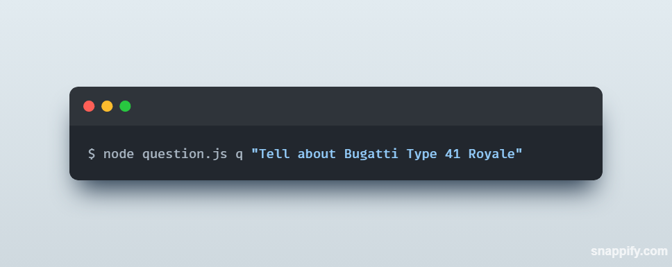
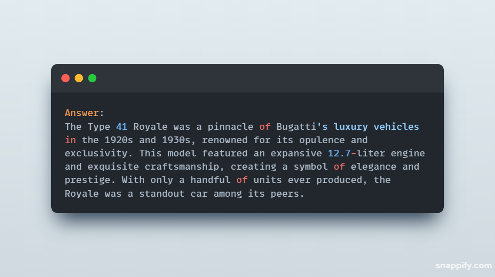
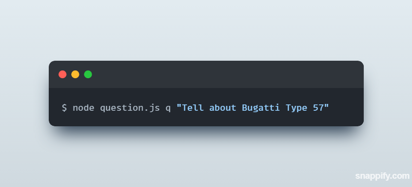
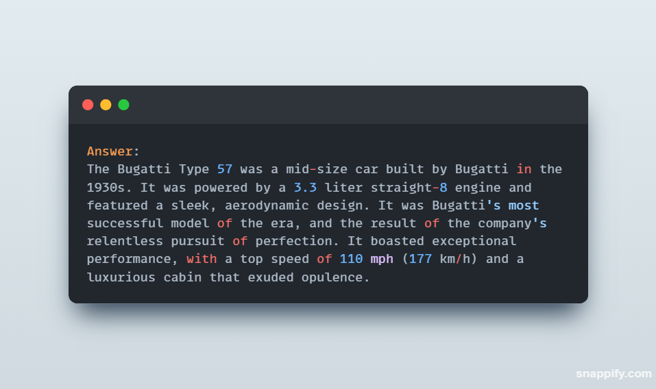
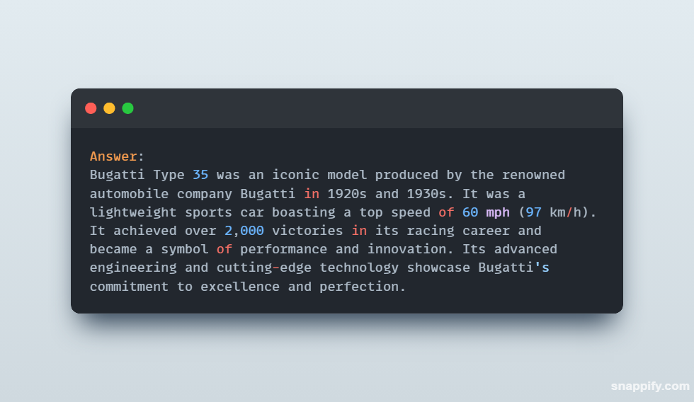
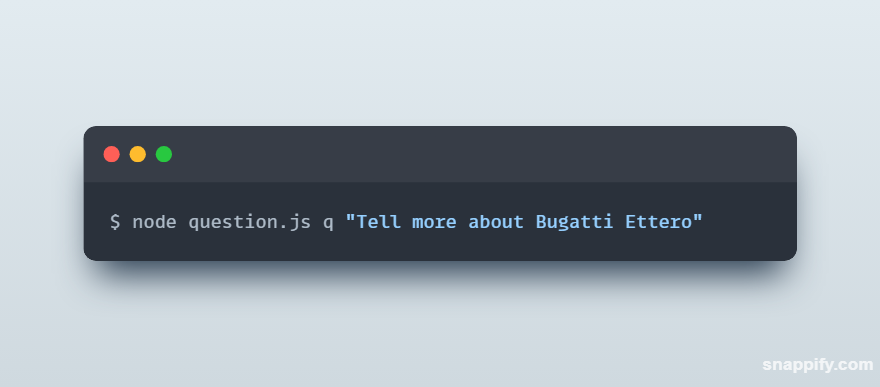
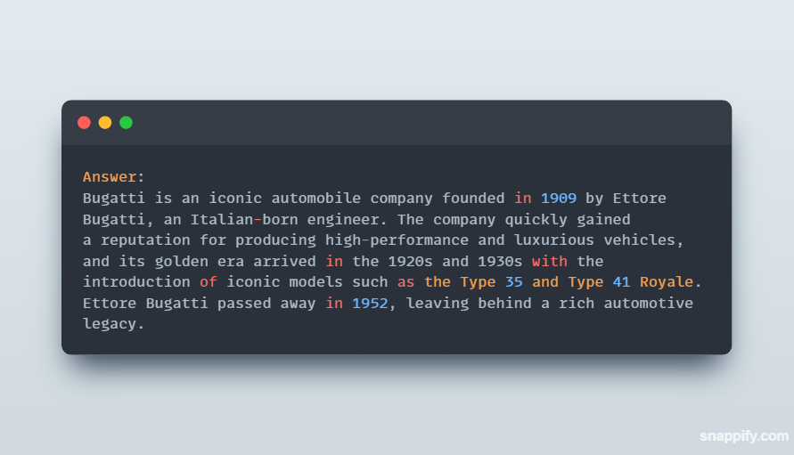

## Table of Content

- [About the Project](#about-the-project)
    - [Motivation](#motivation)
    - [Use Case](#use-case)
    - [Built With](#built-with)
- [Getting Started](#getting-started)
    - [Prerequisites](#prerequisites)
    - [Installation](#installation)
- [Screenshots](#screenshots)
- [Contributors](#contributors)

# About the Project 

This backend project makes it easy for users to find answers in a PDF without having to read the whole file themselves. When users upload a PDF, the system uses special tools and services to save the file, convert it to a text file, which is then copied into a string as context along with the question inputted by the user. The CLI integration helps the user input a query which is then translated into English if written in Hinglish (Hindi words written in the English Script). The prompt is sent to the OpenAI API along with some predefined parameters. The response is then processed and displayed to the user in the Terminal. At the end, the PDF and text files are also deleted after a specific period of time.


## Motivation

With this project, the time consumed in getting information from manuals, etc. is greatly reduced, and the user only needs to send the question instead of spending time reading the files and finding the answers themselves. 


## Use Case

One of the use cases for this project can be in a customer care system. If a user wishes to ask questions regarding a certain product, they can simply upload the PDF of the manual and type the questions, and they would get the answers directly without needing to talk to anyone over the phone.


## Built With

- Node
- OpenAI API
- Azure Storage
- Azure Translation API


# Getting Started

To get a local copy up and running follow these simple example steps.

## Prerequisites

These are some dependencies you will need
* node
    - Download the Latest LTS Version from [here](https://nodejs.org/en/download)

* npm

  ```sh
  npm install npm@latest -g
  ```

* Azure Account
    - Create an Azure Account on [Azure Portal](https://portal.azure.com/) 
    - Create a Translation Resource, and get the API key
    - Create a Blob Storage Service and create a folder with your preferred username.

* OpenAI API 
    - Create an account on [OpenAI website](https://openai.com/), and get your key to use the OpenAI API.

## Installation

After you have completed the prerequisites, now you need to do the following steps to set up your project.

1. Clone the repo

   ```sh
   git clone git@github.com:palakyadav21/GenerativeAI.git
   ````

2. Install NPM packages

   ```sh
   npm install
   ```

3. Create a `.env` file and add the following as mentioned in the `example.env` file

    ```sh
    TRANSLATE_API_KEY = "ADD YOUR KEY HERE"
    ENDPOINT_KEY = "ADD YOUR KEY HERE"
    OPENAI_API_KEY = "ADD YOUR KEY HERE"
    USERNAME = "ADD YOUR USERNAME HERE"
    ```

4. Add a PDF called `context.pdf` to your folder on Azure Storage

5. Run `download.js` to download the file

    ```sh
    node tools/download
    ```

6. Run `question.js` file to ask your question

    ```sh
    node cli/question q "YOUR QUESTION HERE"
    ```

    You can ask the question in Hindi too, as the `textTranslate.js` supports Hindi language as well.

    ```sh
    node cli/question q "QUESTION IN HINDI/HINGLISH"
    ```

7. You can do steps 4 - 6 as many times as you would like to test the project!

# Screenshots

Q:



A:




Q:



A:




Q:


A:




Q:



A:




# Contributors

- [Vishrut Aggarwal](https://github.com/VishrutAggarwal/)

- [Akanksha Kushwaha](https://github.com/aku1310/)

- [Siddhant Vats](https://github.com/siddhantvats05/)

- [Palak Yadav](https://github.com/palakyadav21/)